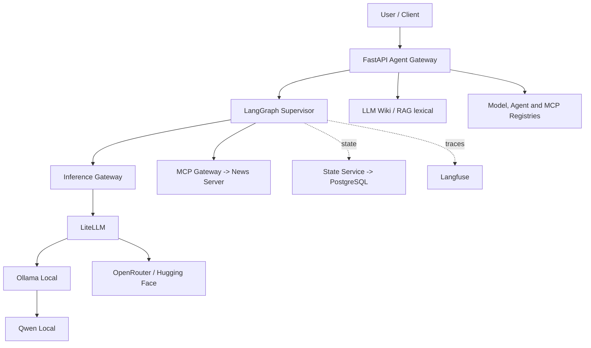

# agentic-ai-platform

MVP open source de uma plataforma agêntica **local first, cloud ready** usando FastAPI, LangGraph, LiteLLM, Ollama, PostgreSQL, Qdrant e Langfuse.

## Objetivo

Entregar uma plataforma administrativa funcional para o fluxo:

`FastAPI -> LangGraph -> Inference Service -> LiteLLM -> Ollama -> Qwen`

com Wiki/RAG, catálogo de modelos cloud, inventários persistentes de agentes e MCPs, governança e observabilidade com Langfuse.

## Arquitetura



## Estrutura do projeto

> Observação: o diretório lógico de plataforma foi implementado como `platform_core/` para evitar colisão com o módulo padrão `platform` do Python.

```text
apps/api/                # FastAPI gateway
apps/web/                # Console administrativo React
agents/supervisor/       # LangGraph supervisor graph
platform_core/           # config, inference, memory, mcp, rag, observability
mcp_servers/             # filesystem e database MCP servers
infrastructure/docker/   # Dockerfile da API
evals/                   # datasets e avaliadores iniciais
tests/                   # unit + integration
```

## Pré-requisitos

- Python 3.12+
- `uv`
- Docker + Docker Compose
- Ollama instalado localmente no macOS

## Instalação

```bash
cp .env.example .env
make setup
```

## Instalação/configuração do Ollama

Instale o Ollama no Mac e inicie o serviço local. Depois baixe um modelo Qwen quantizado compatível com 16 GB de memória, por exemplo:

```bash
ollama pull qwen2.5:7b-instruct-q4_K_M
```

Se necessário, ajuste `OLLAMA_MODEL` no `.env`.

## Configuração `.env`

Principais variáveis:

- `MODEL_BACKEND=litellm`
- `DEFAULT_MODEL_ALIAS=fast`
- `MODEL_MAX_TOKENS=4096`: limita a saída enviada aos provedores e controla custo
- `MODEL_CATALOG_TIMEOUT_SECONDS=10`: timeout das buscas nos catálogos externos
- `DYNAMIC_MODEL_CONFIG_PATH=data/models.json`: registro persistente dos modelos adicionados
- `AGENT_CONFIG_PATH=data/agents.json`: inventário persistente dos agentes instalados
- `MCP_CONFIG_PATH=data/mcp_servers.json`: inventário persistente dos servidores MCP registrados
- `WIKI_CONFIG_PATH=data/wiki.json`: conteúdo persistente da LLM Wiki
- `WIKI_REPOSITORY_ROOT=.`: raiz permitida para importação de arquivos locais pela Wiki
- `REASONING_MODEL_ID=qwen/qwen3-next-80b-a3b-thinking`: modelo usado pelo alias `reasoning` via OpenRouter
- `OPENROUTER_API_KEY`: chave criada em https://openrouter.ai/settings/keys
- `OPENROUTER_FREE_MODEL_ID=openrouter/free`: roteia automaticamente entre modelos gratuitos; também aceita um ID `:free`
- `HF_TOKEN`: token necessário para executar modelos pelo Hugging Face Inference Provider
- `OLLAMA_BASE_URL=http://localhost:11434`
- `STATE_BACKEND=postgres`
- `CONVERSATION_RETENTION_HOURS=24`: remove o histórico das conversas após 24 horas; aceita valores de 1 a 24
- `POSTGRES_HOST=localhost`
- `POSTGRES_PORT=5432`
- `POSTGRES_DB=agentic_ai_platform`
- `POSTGRES_USER=postgres`
- `POSTGRES_PASSWORD=postgres`
- `NEWS_RSS_FEEDS=https://example.com/rss.xml,https://example.com/world.xml`
- `NEWS_TIMEOUT_SECONDS=8`
- `NEWS_MAX_ITEMS=5`
- `LANGFUSE_ENABLED=true`: habilita traces do supervisor e callbacks do LangGraph
- `LANGFUSE_BASE_URL=http://localhost:3000`: endpoint usado quando a API roda no host
- `LANGFUSE_PUBLIC_KEY` e `LANGFUSE_SECRET_KEY`: credenciais do projeto no Langfuse

No Docker Compose, `LANGFUSE_BASE_URL` é sobrescrito para `http://langfuse-web:3000`. Não use `localhost` para conectar a API containerizada ao Langfuse, pois ele apontaria para o próprio container da API.

## Inicialização

### Stack completa com Docker Compose

```bash
make up
```

Esse comando inicia a API, PostgreSQL, Qdrant e o Langfuse self-hosted com seus serviços auxiliares.

### LangGraph Studio

Em outro terminal, inicie o servidor de desenvolvimento do grafo:

```bash
make studio
```

O comando usa o backend stub para permitir inspeção e execução do grafo sem depender do Ollama. Para executar a API principal com o modelo real, mantenha o Ollama ativo conforme a seção anterior.

## Interfaces locais

- API: http://localhost:8000
- Console administrativo: http://localhost:5173
- Swagger: http://localhost:8000/docs
- LangGraph API: http://localhost:2024
- LangGraph API Docs: http://localhost:2024/docs
- LangGraph Studio: https://smith.langchain.com/studio/?baseUrl=http://127.0.0.1:2024
- Langfuse: http://localhost:3000

O LangGraph Studio é hospedado pelo LangSmith e exige login gratuito. O grafo e os dados executados por essa configuração continuam no servidor local em `127.0.0.1:2024`.

Credenciais locais do Langfuse:

- E-mail: `admin@localhost.local`
- Senha: `local-admin-password`

As credenciais, chaves e senhas em `docker-compose.langfuse.yml` são exclusivas para desenvolvimento local. Substitua todos esses valores antes de qualquer implantação compartilhada ou de produção.

### Desenvolvimento local da API

```bash
make dev
```

Em outro terminal, inicie o console administrativo:

```bash
make web
```

Para desenvolvimento local com inferência via LiteLLM e traces enviados diretamente ao Langfuse:

```bash
make dev-observed
```

Esse modo usa o alias configurado em `DEFAULT_MODEL_ALIAS` e requer o Ollama e o Langfuse locais ativos. Para executar sem dependências de inferência, use `make dev-stub`.

### Descoberta e registro de modelos

Abra **Modelos** no console administrativo, escolha OpenRouter ou Hugging Face, pesquise no catálogo e selecione **Adicionar**. O alias passa a aparecer imediatamente no inventário e no Playground. Modelos adicionados são gravados em `data/models.json`; a stack Docker monta `data/` na API para preservar o registro entre recriações do container.

A busca no catálogo do Hugging Face é pública e funciona sem autenticação. Para executar um modelo Hugging Face adicionado, configure `HF_TOKEN` no `.env` e recrie a API. Modelos OpenRouter usam `OPENROUTER_API_KEY`.

Endpoints equivalentes:

- `GET /api/v1/platform/models/discover?provider=openrouter&query=qwen&limit=20`
- `GET /api/v1/platform/models/discover?provider=huggingface&query=qwen&limit=20`
- `POST /api/v1/platform/models`

### Instalação e remoção de agentes

Abra **Agentes** no console administrativo para instalar especialistas do catálogo interno, escolher o alias de modelo usado por cada um e remover agentes instalados. O supervisor é parte central da plataforma e não pode ser removido.

Neste MVP, instalar significa registrar e habilitar uma definição suportada pela plataforma; nenhum código remoto é baixado ou executado. O inventário é persistido em `data/agents.json` e preservado pela montagem `data/` da stack Docker.

Endpoints equivalentes:

- `GET /api/v1/platform/agents`
- `POST /api/v1/platform/agents/{agent_id}/install`
- `DELETE /api/v1/platform/agents/{agent_id}`

### Descoberta, instalação e remoção de MCPs

Abra **MCPs** no console administrativo para pesquisar servidores no [MCP Registry oficial](https://registry.modelcontextprotocol.io/), adicioná-los ao inventário local e remover registros instalados. O inventário é persistido em `data/mcp_servers.json` e preservado pela montagem `data/` da stack Docker.

Nesta versão, a instalação registra metadados como nome, versão, origem e transporte. Ela não baixa pacotes, inicia processos nem conecta automaticamente o servidor descoberto ao gateway de ferramentas. O servidor de notícias integrado continua sendo registrado no gateway durante a inicialização da API.

Endpoints equivalentes:

- `GET /api/v1/platform/mcps`
- `GET /api/v1/platform/mcps/discover?query=filesystem&limit=20`
- `POST /api/v1/platform/mcps`
- `DELETE /api/v1/platform/mcps/{name}`

### LLM Wiki e RAG

Abra **LLM Wiki** para criar páginas Markdown, pesquisar páginas na internet, importar arquivos `.md`/`.txt`, capturar conteúdo de URLs públicas ou indexar a documentação do repositório local. Resultados da busca podem ser inspecionados e importados com um clique. A biblioteca permite busca textual, edição, prévia e perguntas respondidas pelo Inference Gateway com os trechos de origem.

O conteúdo e o índice lexical são persistidos em `data/wiki.json`. `WIKI_REPOSITORY_ROOT` limita a raiz disponível para indexação; somente arquivos `.md` e `.txt` são lidos, com limite de 100 arquivos por operação. Diretórios ocultos, dependências e `data/` são ignorados. Reindexar a mesma fonte atualiza a página existente.

Configuração:

- `WIKI_CONFIG_PATH=data/wiki.json`: registro persistente da Wiki
- `WIKI_REPOSITORY_ROOT=.`: raiz permitida para indexação local
- `APP_MAX_REQUEST_SIZE_BYTES=1048576`: comporta documentos textuais de até 500 KB

Endpoints:

- `GET /api/v1/wiki`
- `GET /api/v1/wiki/search?query=langgraph&limit=8`
- `POST /api/v1/wiki/pages`
- `PUT /api/v1/wiki/pages/{page_id}`
- `DELETE /api/v1/wiki/pages/{page_id}`
- `POST /api/v1/wiki/import/file`
- `POST /api/v1/wiki/import/url`
- `POST /api/v1/wiki/import/repository`
- `POST /api/v1/wiki/ask`

### Observabilidade com Langfuse

A stack completa já habilita o Langfuse na API containerizada:

```bash
make up
curl -sS http://localhost:8000/ready
```

O check `observability` deve retornar `{"ok":true,"enabled":true,"backend":"langfuse"}`. Para gerar um trace:

```bash
curl -sS -X POST http://localhost:8000/api/v1/chat \
  -H "Content-Type: application/json" \
  -d '{"message":"Explique observabilidade de agentes."}'
```

Acesse http://localhost:3000 com as credenciais locais, abra **Observations** e filtre pelo nome `supervisor-chat` ou por `Is Root Observation = true`. No Langfuse v4, traces são conjuntos de observations com o mesmo `trace_id`; os endpoints legados de traces e observations podem retornar vazio ou indisponível no modo `events_only` e não devem ser usados como health check.

## Testes e quality gates

```bash
make test
make lint
```

## Endpoints

- `GET /health`
- `GET /ready`
- `POST /api/v1/chat`
- `GET /api/v1/platform/overview`
- `GET /api/v1/platform/models/discover`
- `POST /api/v1/platform/models`
- `GET /api/v1/platform/agents`
- `POST /api/v1/platform/agents/{agent_id}/install`
- `DELETE /api/v1/platform/agents/{agent_id}`
- `GET /api/v1/platform/mcps`
- `GET /api/v1/platform/mcps/discover`
- `POST /api/v1/platform/mcps`
- `DELETE /api/v1/platform/mcps/{name}`
- `GET /api/v1/wiki`
- `GET /api/v1/wiki/search`
- `POST /api/v1/wiki/pages`
- `POST /api/v1/wiki/import/file`
- `POST /api/v1/wiki/import/url`
- `POST /api/v1/wiki/import/repository`
- `POST /api/v1/wiki/ask`

Exemplo:

```bash
curl -X POST http://localhost:8000/api/v1/chat \
  -H "Content-Type: application/json" \
  -d '{"message":"Explique o que é uma plataforma agêntica."}'
```

Para consultas de notícias, envie mensagens como "quais são as notícias de tecnologia?" com `NEWS_RSS_FEEDS` configurado.

## Troubleshooting

- **`/ready` falha no Ollama**: confirme que `ollama serve` está ativo e que `OLLAMA_BASE_URL` aponta para `http://localhost:11434` (host) ou `http://host.docker.internal:11434` (container).
- **Observabilidade habilitada, mas com `ok: false`**: confirme que a API Docker usa `LANGFUSE_BASE_URL=http://langfuse-web:3000`. Se o container mantiver valores antigos do `.env`, recrie somente a API com `docker compose -f docker-compose.yml -f docker-compose.langfuse.yml up -d --no-deps --force-recreate api`.
- **Nenhuma observation no Langfuse v4**: execute uma chamada em `POST /api/v1/chat`, abra **Observations** e remova filtros salvos antes de buscar por `supervisor-chat`.
- **Banco indisponível**: valide `DATABASE_URL` e execute `make up` para subir PostgreSQL.
- **Modelo não encontrado**: rode `ollama list` e ajuste `OLLAMA_MODEL`.
- **Modelo Hugging Face retorna 503**: configure `HF_TOKEN` no `.env` e recrie a API; buscar e adicionar modelos não exige o token.
- **Modelo remoto não executa**: confirme que a credencial do provedor está configurada e que o modelo oferece inferência hospedada compatível com chat/text generation.
- **OpenRouter retorna 429**: o provedor selecionado está temporariamente limitado; tente novamente ou escolha outro modelo/provedor no catálogo.
- **MCP Registry retorna 502**: confirme o acesso da API à internet; a descoberta depende de `registry.modelcontextprotocol.io`, mas o inventário local continua disponível.
- **LLM Wiki abre vazia após recriar a API**: confirme que a stack monta `./data:/app/data` e que `WIKI_CONFIG_PATH=data/wiki.json` não foi alterado para um caminho fora desse volume.

## Decisões arquiteturais

1. **Model alias first**: agentes pedem `fast` ou `reasoning`; nomes físicos ficam no `litellm.yaml`.
2. **LangGraph simples no MVP**: `START -> Supervisor -> LLM -> END`; Wiki/RAG e registros administrativos permanecem serviços explícitos da API.
3. **PostgreSQL e Qdrant já containerizados**: disponíveis desde o início sem forçar uso prematuro do Qdrant.
4. **MCP desacoplado**: o gateway de execução e o inventário do catálogo oficial têm responsabilidades separadas.
5. **Observabilidade local**: logs estruturados e traces do LangGraph enviados ao Langfuse self-hosted.

## Roadmap

1. Persistência de memória mais rica no PostgreSQL
2. Evolução da recuperação lexical da Wiki para embeddings no Qdrant
3. Provisionamento e conexão dos MCPs instalados ao gateway de execução
4. Dashboards, avaliações e alertas no Langfuse
5. Comparação de modelos local vs cloud em `evals/`
