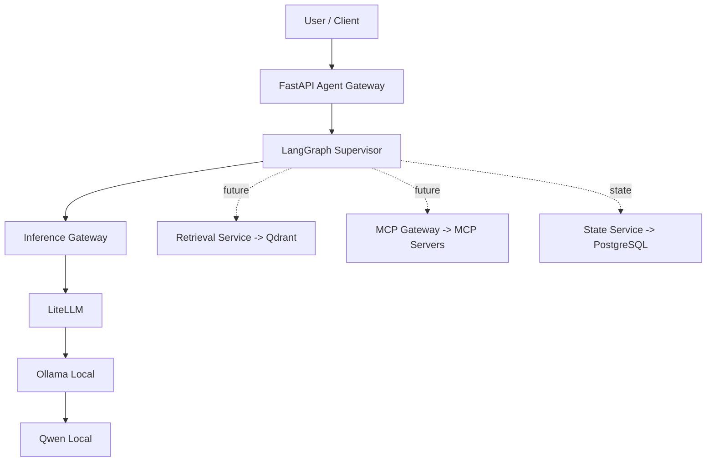

# agentic-ai-platform

MVP open source de uma plataforma agêntica **local first, cloud ready** usando FastAPI, LangGraph, LiteLLM, Ollama, PostgreSQL e Qdrant.

## Objetivo

Entregar um vertical slice funcional para o fluxo:

`FastAPI -> LangGraph -> Inference Service -> LiteLLM -> Ollama -> Qwen`

com a arquitetura preparada para evoluir para RAG, MCP, observabilidade com Langfuse e backends cloud/vLLM sem reescrever os agentes.

## Arquitetura



## Estrutura do projeto

> Observação: o diretório lógico de plataforma foi implementado como `platform_core/` para evitar colisão com o módulo padrão `platform` do Python.

```text
apps/api/                # FastAPI gateway
agents/supervisor/       # LangGraph supervisor graph
platform_core/           # config, inference, memory, mcp, rag, observability
mcp_servers/             # filesystem e database MCP servers
infrastructure/docker/   # Dockerfile da API
evals/                   # datasets e avaliadores iniciais
tests/                   # unit + integration
```

## Pré-requisitos

- Python 3.12+
- `uv`
- Docker + Docker Compose
- Ollama instalado localmente no macOS

## Instalação

```bash
cp .env.example .env
make setup
```

## Instalação/configuração do Ollama

Instale o Ollama no Mac e inicie o serviço local. Depois baixe um modelo Qwen quantizado compatível com 16 GB de memória, por exemplo:

```bash
ollama pull qwen2.5:7b-instruct-q4_K_M
```

Se necessário, ajuste `OLLAMA_MODEL` no `.env`.

## Configuração `.env`

Principais variáveis:

- `MODEL_BACKEND=litellm`
- `DEFAULT_MODEL_ALIAS=fast`
- `OLLAMA_BASE_URL=http://localhost:11434`
- `STATE_BACKEND=postgres`
- `POSTGRES_HOST=localhost`
- `POSTGRES_PORT=5432`
- `POSTGRES_DB=agentic_ai_platform`
- `POSTGRES_USER=postgres`
- `POSTGRES_PASSWORD=postgres`

## Inicialização

### Stack completa com Docker Compose

```bash
make up
```

### Desenvolvimento local da API

```bash
make dev
```

## Testes e quality gates

```bash
make test
make lint
```

## Endpoints

- `GET /health`
- `GET /ready`
- `POST /api/v1/chat`

Exemplo:

```bash
curl -X POST http://localhost:8000/api/v1/chat \
  -H "Content-Type: application/json" \
  -d '{"message":"Explique o que é uma plataforma agêntica."}'
```

## Troubleshooting

- **`/ready` falha no Ollama**: confirme que `ollama serve` está ativo e que `OLLAMA_BASE_URL` aponta para `http://localhost:11434` (host) ou `http://host.docker.internal:11434` (container).
- **Banco indisponível**: valide `DATABASE_URL` e execute `make up` para subir PostgreSQL.
- **Modelo não encontrado**: rode `ollama list` e ajuste `OLLAMA_MODEL`.

## Decisões arquiteturais

1. **Model alias first**: agentes pedem `fast` ou `reasoning`; nomes físicos ficam no `litellm.yaml`.
2. **LangGraph simples no MVP**: `START -> Supervisor -> LLM -> END`, com pontos claros para RAG/SQL/Tools.
3. **PostgreSQL e Qdrant já containerizados**: disponíveis desde o início sem forçar uso prematuro do Qdrant.
4. **MCP desacoplado**: filesystem/database expostos como servidores separados, não embutidos na lógica do agente.
5. **Observabilidade enxuta**: logs estruturados agora; Langfuse fica opcional para preservar recursos no M4.

## Roadmap

1. Persistência de memória mais rica no PostgreSQL
2. Ingestão TXT/Markdown + Retrieval Service em Qdrant
3. MCP filesystem/database conectado ao supervisor
4. Langfuse opcional por configuração
5. Comparação de modelos local vs cloud em `evals/`
