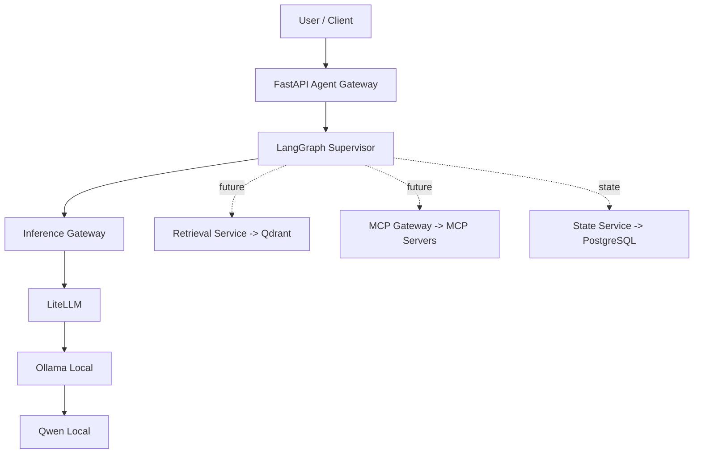

# agentic-ai-platform

MVP open source de uma plataforma agêntica **local first, cloud ready** usando FastAPI, LangGraph, LiteLLM, Ollama, PostgreSQL, Qdrant e Langfuse.

## Objetivo

Entregar um vertical slice funcional para o fluxo:

`FastAPI -> LangGraph -> Inference Service -> LiteLLM -> Ollama -> Qwen`

com a arquitetura preparada para evoluir para RAG, MCP, observabilidade com Langfuse e backends cloud/vLLM sem reescrever os agentes.

## Arquitetura



## Estrutura do projeto

> Observação: o diretório lógico de plataforma foi implementado como `platform_core/` para evitar colisão com o módulo padrão `platform` do Python.

```text
apps/api/                # FastAPI gateway
apps/web/                # Console administrativo React
agents/supervisor/       # LangGraph supervisor graph
platform_core/           # config, inference, memory, mcp, rag, observability
mcp_servers/             # filesystem e database MCP servers
infrastructure/docker/   # Dockerfile da API
evals/                   # datasets e avaliadores iniciais
tests/                   # unit + integration
```

## Pré-requisitos

- Python 3.12+
- `uv`
- Docker + Docker Compose
- Ollama instalado localmente no macOS

## Instalação

```bash
cp .env.example .env
make setup
```

## Instalação/configuração do Ollama

Instale o Ollama no Mac e inicie o serviço local. Depois baixe um modelo Qwen quantizado compatível com 16 GB de memória, por exemplo:

```bash
ollama pull qwen2.5:7b-instruct-q4_K_M
```

Se necessário, ajuste `OLLAMA_MODEL` no `.env`.

## Configuração `.env`

Principais variáveis:

- `MODEL_BACKEND=litellm`
- `DEFAULT_MODEL_ALIAS=fast`
- `OLLAMA_BASE_URL=http://localhost:11434`
- `STATE_BACKEND=postgres`
- `POSTGRES_HOST=localhost`
- `POSTGRES_PORT=5432`
- `POSTGRES_DB=agentic_ai_platform`
- `POSTGRES_USER=postgres`
- `POSTGRES_PASSWORD=postgres`
- `NEWS_RSS_FEEDS=https://example.com/rss.xml,https://example.com/world.xml`
- `NEWS_TIMEOUT_SECONDS=8`
- `NEWS_MAX_ITEMS=5`

## Inicialização

### Stack completa com Docker Compose

```bash
make up
```

Esse comando inicia a API, PostgreSQL, Qdrant e o Langfuse self-hosted com seus serviços auxiliares.

### LangGraph Studio

Em outro terminal, inicie o servidor de desenvolvimento do grafo:

```bash
make studio
```

O comando usa o backend stub para permitir inspeção e execução do grafo sem depender do Ollama. Para executar a API principal com o modelo real, mantenha o Ollama ativo conforme a seção anterior.

## Interfaces locais

- API: http://localhost:8000
- Console administrativo: http://localhost:5173
- Swagger: http://localhost:8000/docs
- LangGraph API: http://localhost:2024
- LangGraph API Docs: http://localhost:2024/docs
- LangGraph Studio: https://smith.langchain.com/studio/?baseUrl=http://127.0.0.1:2024
- Langfuse: http://localhost:3000

O LangGraph Studio é hospedado pelo LangSmith e exige login gratuito. O grafo e os dados executados por essa configuração continuam no servidor local em `127.0.0.1:2024`.

Credenciais locais do Langfuse:

- E-mail: `admin@localhost.local`
- Senha: `local-admin-password`

As credenciais, chaves e senhas em `docker-compose.langfuse.yml` são exclusivas para desenvolvimento local. Substitua todos esses valores antes de qualquer implantação compartilhada ou de produção.

### Desenvolvimento local da API

```bash
make dev
```

Em outro terminal, inicie o console administrativo:

```bash
make web
```

Para desenvolvimento local com inferência stub e traces enviados diretamente ao Langfuse:

```bash
make dev-observed
```

## Testes e quality gates

```bash
make test
make lint
```

## Endpoints

- `GET /health`
- `GET /ready`
- `POST /api/v1/chat`
- `GET /api/v1/platform/overview`

Exemplo:

```bash
curl -X POST http://localhost:8000/api/v1/chat \
  -H "Content-Type: application/json" \
  -d '{"message":"Explique o que é uma plataforma agêntica."}'
```

Para consultas de notícias, envie mensagens como "quais são as notícias de tecnologia?" com `NEWS_RSS_FEEDS` configurado.

## Troubleshooting

- **`/ready` falha no Ollama**: confirme que `ollama serve` está ativo e que `OLLAMA_BASE_URL` aponta para `http://localhost:11434` (host) ou `http://host.docker.internal:11434` (container).
- **Banco indisponível**: valide `DATABASE_URL` e execute `make up` para subir PostgreSQL.
- **Modelo não encontrado**: rode `ollama list` e ajuste `OLLAMA_MODEL`.

## Decisões arquiteturais

1. **Model alias first**: agentes pedem `fast` ou `reasoning`; nomes físicos ficam no `litellm.yaml`.
2. **LangGraph simples no MVP**: `START -> Supervisor -> LLM -> END`, com pontos claros para RAG/SQL/Tools.
3. **PostgreSQL e Qdrant já containerizados**: disponíveis desde o início sem forçar uso prematuro do Qdrant.
4. **MCP desacoplado**: filesystem/database expostos como servidores separados, não embutidos na lógica do agente.
5. **Observabilidade local**: logs estruturados e traces do LangGraph enviados ao Langfuse self-hosted.

## Roadmap

1. Persistência de memória mais rica no PostgreSQL
2. Ingestão TXT/Markdown + Retrieval Service em Qdrant
3. MCP filesystem/database conectado ao supervisor
4. Dashboards, avaliações e alertas no Langfuse
5. Comparação de modelos local vs cloud em `evals/`
